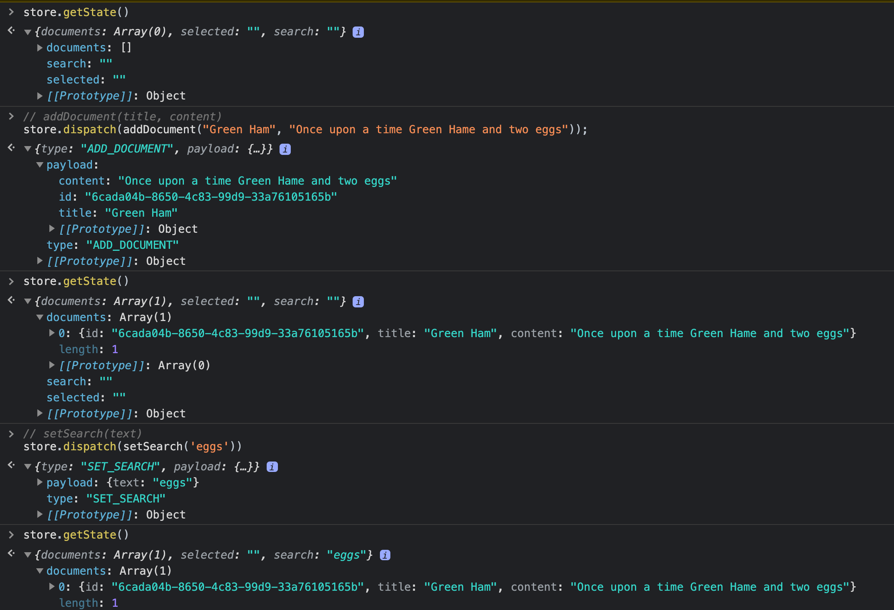
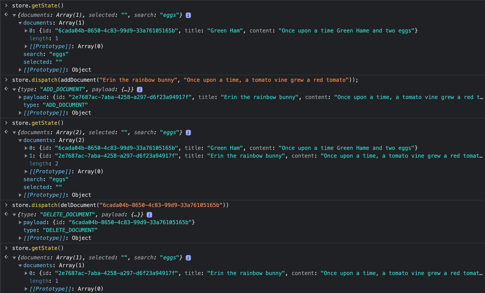
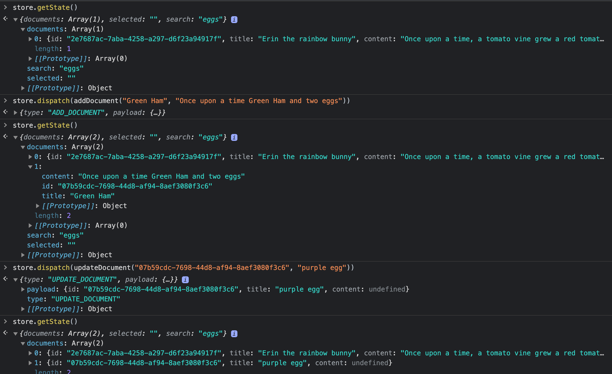
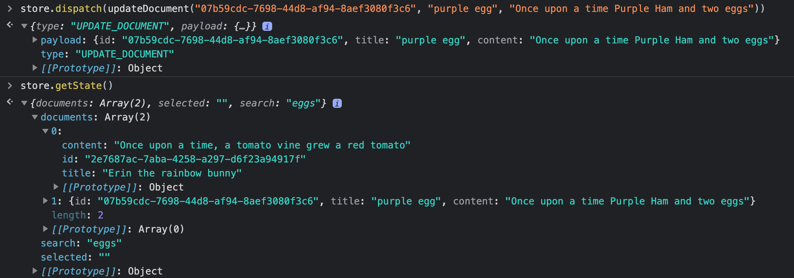
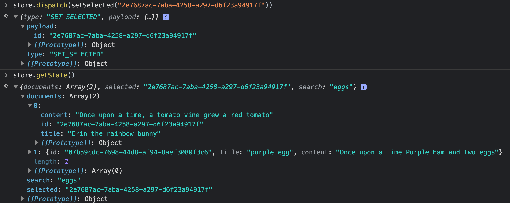

# [File Editor Part 1](https://learn.digitalcrafts.com/flex/lessons/full-stack-frameworks/multiple-reducers/#setting-up)

- Console demo:








- create js files actions, reducers, store

* The workflow Redux:

  1. Define the default/example state

  2. Write Actions that describe how that state can change.

  3. Write a Reducer that expects to receive the state and an action, and returns a modified copy of the state.

### 1. Define the state:
  * Array of documents
  * ID of the selected doc
  * Text to search for

### 2. List of Actions:

  * add a document
  * delete a document
  * update a document
  * set the selected document ID
  * set the search text

- install uuid npm package to generate unique IDs for add new documents
> https://www.npmjs.com/package/uuid

```js

// inside reducers.js)
import {
  ADD_DOCUMENT,
  UPDATE_DOCUMENT,
  DELETE_DOCUMENT,
  SET_SELECTED,
  SET_SEARCH
} from './actions';

const appReducer = (state, action) => {
  switch (action.type) {
    case ADD_DOCUMENT:
      return {
        ...state, // cp state, overwriting documents
        documents: [
          // Copy of existing documents + new document
        ]
      }
    case DELETE_DOCUMENT:
      return {
        ...state, // cp state, overwriting documents
        documents: [
          // Copy of existing documents - one to delete
        ]
      }
    case UPDATE_DOCUMENT:
      return {
        ...state, // cp state, overwriting documents
        documents: [
          // Copy of existing documents, modifying matching doc
        ]
      }
    case SET_SELECTED:
      return {
        ...state, // cp state, overwriting selected ID
        selected: action.payload.id
      }
    case SET_SEARCH:
      return {
        ...state, // cp state, overwriting search text
        search: action.payload.text
      }
    default:
      return state;
  }
};

export default appReducer;

// ****** refactor to have 
//  three simpler reducers
//  1. documents() manages the documents slice
//  2. selected() manages selected slice
//  3. search() manages search slice

function documents(state = [], action) {
  switch (action.type) {
    case ADD_DOCUMENT:
      return [
        ...state, // copy (slice of) state passed in
        action.payload,
      ];
    case DELETE_DOCUMENT:
      // copy of state Array, filtering out doc ID is in payload
      return state.filter((doc) => doc.id !== action.payload.id);
    case UPDATE_DOCUMENT:
      // copy of state Array, altering the single doc whose ID is in the payload
      return state.map((doc) =>
        doc.id !== action.payload.id ? doc : { ...action.payload }
      );
  }
  return state;
}

function selected(state = "", action) {
  // action that returns the value from the payload
  //  when they are responsible for handling.
  switch (action.type) {
    case SET_SELECTED:
      return action.payload.id;
  }
  return state;
}

function search() {
  // action that returns the value from the payload
  //  when they are responsible for handling.
  switch(action.type) {
    case SET_SEARCH:
      return action.payload.text;
  }
  return state;
}
```

- Combine 3 simpler reducers

```jsx
// Combine Reducers, step 1: get combine reducers function from redux
import { combineReducers } from "redux";

// Combine Reducers, step 2: call combineReducers(), pass Obj, Key (slice of state): Value (name of Reducer function)
// as you see above I created 3 reducer functions: 1. documents, 2. selected, 3. search.  Here I am assigning these functions inside of Obje and passing it inside of combineReducers()
export const rootReducer = combineReducers({
  documents,
  selected,
  search,
});
```

### Creating the Redux Store:
- once the reducers are combined, we can create the store!

* import my reducers into the store and name it rootReducer,
* import createStore to implement the store.


#### how do my `actionCreator` functions come over to `reducer.js`?

```js
function documents(state = [], action) {
  switch (action.type) {
    case ADD_DOCUMENT:
      return [
        ...state, // copy (slice of) state passed in
        action.payload,
      ];
    case DELETE_DOCUMENT:
      // copy of state Array, filtering out doc ID is in payload
      return state.filter((doc) => doc.id !== action.payload.id);
    case UPDATE_DOCUMENT:
      // copy of state Array, altering the single doc whose ID is in the payload
      return state.map((doc) =>
        doc.id !== action.payload.id ? doc : { ...action.payload }
      );
  }
  return state;
}
```
* Let's look at `case DELETE_DOCUMENT`:

  - Where does `doc.id !== action.payload.id`'s `action.payload.id` comes from?  
    * my action creator function gets passed in as a param: `action`.  This is the key where all the payload obj key:value pairs are passed in.
    
    * case1) 
    ```js
    // inside of `actions.js`)
    export function addDocument(title, content) {
      return {
        type: ADD_DOCUMENT,
        payload: {
          id: uuidv4(), // Generate a unique id
          title,
          content,
        },
      };
    }

    // inside of reducers.js)
    function documents(state = [], action) {
      switch (action.type) {
        case ADD_DOCUMENT:
          return [
            ...state, // copy (slice of) state passed in, particularly for slice that this reducer is responsible for.
            action.payload,  // looking back at my action creator action.type: ADD_DOCUMENT, action.payload obj include id, title, content.
          ];
    ```

### Create Redux Store:
- [Redux doc site](https://redux.js.org/usage/structuring-reducers/using-combinereducers) 

```js
// import comineReducers, createStore
import { combineReducers, createStore } from "redux";


// end of the file createStore(), pass rootReducer as param
const reducerInitializedStore = createStore(rootReducer)
```

## Test it out in console:
```js
store.getState() // nothing in there. {documents: [], selected: "", search: ""}
// Add title and content to my document app.  Remember the function signature for addDocument(title, content)
store.dispatch(addDocument("Green Ham", "Once upon a time Green Ham and two eggs")); // action.type "ADD_DOCUMENT" => {type: "ADD_DOCUMENT", payload: {content: "Once upon a time Green Ham and two eggs, id: "6cada04b-8650-4c83-99d9-33a76105165b", title: "Green Ham"}}
store.getState() // see the new state. {documents: [{id: "6cada04b-8650-4c83-99d9-33a76105165b", title: "Green Ham", content: "Once upon a time Green Ham and two eggs"}], selected: "", search: ""}

// setSearch(text)
store.dispatch(setSearch('eggs')) // action.type "SET_SEARCH" => {type: "SET_SEARCH", payload: {text: "eggs"}}
// view the newly update state after setSearch('eggs')
store.getState() // {documents: [{id: "6cada04b-8650-4c83-99d9-33a76105165b", title: "Green Ham", content: "Once upon a time Green Ham and two eggs"}], selected: "", search: "eggs"}

// add another document
store.dispatch(addDocument("Erin the rainbow bunny", "Once upon a time, a tomato vine grew a rainbow tomato")); // => {type: "ADD_DOCUMENT", payload: {content: "Once upon a time, a tomato vine grew a rainbow tomato, id: "2e7687ac-7aba-4258-a297-d6f23a94917f", title: "Erin the rainbow bunny"}}
// see new state
store.getState() // {documents: [{id: "6cada04b-8650-4c83-99d9-33a76105165b", title: "Green Ham", content: "Once upon a time Green Ham and two eggs"}, {id: "2e7687ac-7aba-4258-a297-d6f23a94917f", title: "Erin the rainbow bunny", content: "Once upon a time, a tomato vine grew a rainbow tomato"}], selected: "", search: "eggs"}

// delete a doc by ID
store.dispatch(delDocument("6cada04b-8650-4c83-99d9-33a76105165b")) // => {type: "DELETE_DOCUMENT", payload: {id: "6cada04b-8650-4c83-99d9-33a76105165b"}}
// see newly updated state after deleting
store.getState() // => {documents: [{id: "2e7687ac-7aba-4258-a297-d6f23a94917f", title: "Erin the rainbow bunny", content: "Once upon a time, a tomato vine grew a rainbow tomato"}], selected: "", search: "eggs"}]}.  Notice now I have only one document.  The doc with green ham is gone.

// update a doc look up by ID
/**
 * Let's first review my updateDocument action creator function.
 * actionCreator function updateDocument(id, title, content) which returns payload.id, title, content
 * 
 * action.type of UPDATE_DOCUMENT:
 *   returns state.map((doc) => 
 * // each doc of array, if doc.id passed in doesn't match the action.payload.id then pass the doc obj as it is (do not update).  Else, update the user passed in `doc.id` that matches its document obj => altered title and content as user wishes.
 *    doc.id !== action.payload.id ? doc : { ...action.payload })
 * 
*/
store.dispatch(updateDocument("07b59cdc-7698-44d8-af94-8aef3080f3c6", "purple egg", "Once upon a time Purple Ham and two eggs"))
// => {type: "UPDATE_DOCUMENT", payload: {id: "07b59cdc-7698-44d8-af94-8aef3080f3c6", title: "purple egg", content: "Once upon a time Purple Ham and two eggs"}}
store.getState() // => {documents: [{id: "07b59cdc-7698-44d8-af94-8aef3080f3c6", title: "purple egg", content: "Once upon a time Purple Ham and two eggs"}, {id: "2e7687ac-7aba-4258-a297-d6f23a94917f", title: "Erin the rainbow bunny", content: "Once upon a time, a tomato vine grew a red tomato"}], selected: "", search: "eggs"}  

// select a doc by ID
store.dispatch(setSelected("2e7687ac-7aba-4258-a297-d6f23a94917f"))
// => {type: "SET_SELECTED", payload: {id: "2e7687ac-7aba-4258-a297-d6f23a94917f"}}
store.getState() // => {documents: [{},{}], selected: "2e7687ac-7aba-4258-a297-d6f23a94917f", search: "eggs"}

```

